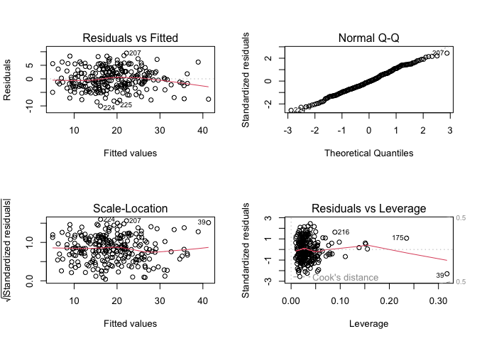

test for untransformation
================
Tvisha R. Devavarapu
2022-12-12

``` r
library(tidyverse)
library(ggplot2)
library(patchwork)
library(GGally)
library(leaps)
library(caret)
```

``` r
bodyfat_df = 
  readxl::read_excel("body_density_data.xlsx") %>%
  janitor::clean_names() 

head(bodyfat_df)
```

    ## # A tibble: 6 × 17
    ##      id bodyfat_…¹ bodyf…² body_…³   age weight height  neck chest abdomen   hip
    ##   <dbl>      <dbl>   <dbl>   <dbl> <dbl>  <dbl>  <dbl> <dbl> <dbl>   <dbl> <dbl>
    ## 1     1       12.6    12.3    1.07    23   154.   67.8  36.2  93.1    85.2  94.5
    ## 2     2        6.9     6.1    1.09    22   173.   72.2  38.5  93.6    83    98.7
    ## 3     3       24.6    25.3    1.04    22   154    66.2  34    95.8    87.9  99.2
    ## 4     4       10.9    10.4    1.08    26   185.   72.2  37.4 102.     86.4 101. 
    ## 5     5       27.8    28.7    1.03    24   184.   71.2  34.4  97.3   100   102. 
    ## 6     6       20.6    20.9    1.05    24   210.   74.8  39   104.     94.4 108. 
    ## # … with 6 more variables: thigh <dbl>, knee <dbl>, ankle <dbl>, bicep <dbl>,
    ## #   forearm <dbl>, wrist <dbl>, and abbreviated variable names ¹​bodyfat_brozek,
    ## #   ²​bodyfat_siri, ³​body_density

``` r
bodyfat_df = 
  bodyfat_df %>% 
  select(-id, -bodyfat_siri, -body_density)
```

``` r
mult.fit = lm(bodyfat_brozek ~ ., data = bodyfat_df)
step(mult.fit, direction = 'backward')
```

    ## Start:  AIC=711.28
    ## bodyfat_brozek ~ age + weight + height + neck + chest + abdomen + 
    ##     hip + thigh + knee + ankle + bicep + forearm + wrist
    ## 
    ##           Df Sum of Sq    RSS    AIC
    ## - knee     1      0.06 3792.8 709.28
    ## - chest    1      0.48 3793.2 709.31
    ## - height   1      0.79 3793.5 709.33
    ## - ankle    1     10.54 3803.3 709.98
    ## - bicep    1     14.79 3807.5 710.26
    ## - hip      1     28.74 3821.5 711.18
    ## <none>                 3792.7 711.28
    ## - weight   1     38.08 3830.8 711.79
    ## - thigh    1     51.79 3844.5 712.69
    ## - age      1     62.72 3855.5 713.41
    ## - neck     1     65.15 3857.9 713.57
    ## - forearm  1     88.02 3880.8 715.06
    ## - wrist    1    148.65 3941.4 718.96
    ## - abdomen  1   1794.28 5587.0 806.89
    ## 
    ## Step:  AIC=709.28
    ## bodyfat_brozek ~ age + weight + height + neck + chest + abdomen + 
    ##     hip + thigh + ankle + bicep + forearm + wrist
    ## 
    ##           Df Sum of Sq    RSS    AIC
    ## - chest    1      0.47 3793.3 707.31
    ## - height   1      0.94 3793.7 707.34
    ## - ankle    1     10.60 3803.4 707.98
    ## - bicep    1     14.92 3807.7 708.27
    ## - hip      1     29.07 3821.9 709.20
    ## <none>                 3792.8 709.28
    ## - weight   1     38.83 3831.6 709.85
    ## - thigh    1     56.03 3848.8 710.98
    ## - neck     1     65.52 3858.3 711.60
    ## - age      1     65.97 3858.8 711.63
    ## - forearm  1     88.24 3881.0 713.08
    ## - wrist    1    149.92 3942.7 717.05
    ## - abdomen  1   1794.44 5587.2 804.90
    ## 
    ## Step:  AIC=707.31
    ## bodyfat_brozek ~ age + weight + height + neck + abdomen + hip + 
    ##     thigh + ankle + bicep + forearm + wrist
    ## 
    ##           Df Sum of Sq    RSS    AIC
    ## - height   1      0.60 3793.9 705.35
    ## - ankle    1     10.88 3804.2 706.03
    ## - bicep    1     14.72 3808.0 706.29
    ## - hip      1     28.75 3822.0 707.22
    ## <none>                 3793.3 707.31
    ## - weight   1     55.78 3849.1 708.99
    ## - thigh    1     60.97 3854.2 709.33
    ## - neck     1     65.36 3858.6 709.62
    ## - age      1     65.70 3859.0 709.64
    ## - forearm  1     87.98 3881.3 711.09
    ## - wrist    1    149.58 3942.9 715.06
    ## - abdomen  1   2024.09 5817.4 813.07
    ## 
    ## Step:  AIC=705.35
    ## bodyfat_brozek ~ age + weight + neck + abdomen + hip + thigh + 
    ##     ankle + bicep + forearm + wrist
    ## 
    ##           Df Sum of Sq    RSS    AIC
    ## - ankle    1     11.20 3805.1 704.09
    ## - bicep    1     16.21 3810.1 704.43
    ## - hip      1     28.16 3822.0 705.22
    ## <none>                 3793.9 705.35
    ## - thigh    1     63.66 3857.5 707.55
    ## - neck     1     65.45 3859.3 707.66
    ## - age      1     66.23 3860.1 707.71
    ## - forearm  1     88.14 3882.0 709.14
    ## - weight   1    102.94 3896.8 710.10
    ## - wrist    1    151.52 3945.4 713.22
    ## - abdomen  1   2737.19 6531.1 840.23
    ## 
    ## Step:  AIC=704.09
    ## bodyfat_brozek ~ age + weight + neck + abdomen + hip + thigh + 
    ##     bicep + forearm + wrist
    ## 
    ##           Df Sum of Sq    RSS    AIC
    ## - bicep    1     14.91 3820.0 703.08
    ## - hip      1     29.32 3834.4 704.03
    ## <none>                 3805.1 704.09
    ## - age      1     63.17 3868.2 706.24
    ## - thigh    1     66.76 3871.8 706.48
    ## - neck     1     74.16 3879.2 706.96
    ## - forearm  1     87.57 3892.6 707.83
    ## - weight   1     92.42 3897.5 708.14
    ## - wrist    1    140.36 3945.4 711.22
    ## - abdomen  1   2740.72 6545.8 838.80
    ## 
    ## Step:  AIC=703.08
    ## bodyfat_brozek ~ age + weight + neck + abdomen + hip + thigh + 
    ##     forearm + wrist
    ## 
    ##           Df Sum of Sq    RSS    AIC
    ## <none>                 3820.0 703.08
    ## - hip      1     33.23 3853.2 703.26
    ## - neck     1     67.79 3887.8 705.51
    ## - age      1     67.88 3887.9 705.52
    ## - weight   1     81.50 3901.5 706.40
    ## - thigh    1     90.34 3910.3 706.97
    ## - forearm  1    122.99 3943.0 709.07
    ## - wrist    1    139.46 3959.4 710.12
    ## - abdomen  1   2726.49 6546.5 836.83

    ## 
    ## Call:
    ## lm(formula = bodyfat_brozek ~ age + weight + neck + abdomen + 
    ##     hip + thigh + forearm + wrist, data = bodyfat_df)
    ## 
    ## Coefficients:
    ## (Intercept)          age       weight         neck      abdomen          hip  
    ##   -20.06213      0.05922     -0.08414     -0.43189      0.87721     -0.18641  
    ##       thigh      forearm        wrist  
    ##     0.28644      0.48255     -1.40487

``` r
step(mult.fit, direction = 'both')
```

    ## Start:  AIC=711.28
    ## bodyfat_brozek ~ age + weight + height + neck + chest + abdomen + 
    ##     hip + thigh + knee + ankle + bicep + forearm + wrist
    ## 
    ##           Df Sum of Sq    RSS    AIC
    ## - knee     1      0.06 3792.8 709.28
    ## - chest    1      0.48 3793.2 709.31
    ## - height   1      0.79 3793.5 709.33
    ## - ankle    1     10.54 3803.3 709.98
    ## - bicep    1     14.79 3807.5 710.26
    ## - hip      1     28.74 3821.5 711.18
    ## <none>                 3792.7 711.28
    ## - weight   1     38.08 3830.8 711.79
    ## - thigh    1     51.79 3844.5 712.69
    ## - age      1     62.72 3855.5 713.41
    ## - neck     1     65.15 3857.9 713.57
    ## - forearm  1     88.02 3880.8 715.06
    ## - wrist    1    148.65 3941.4 718.96
    ## - abdomen  1   1794.28 5587.0 806.89
    ## 
    ## Step:  AIC=709.28
    ## bodyfat_brozek ~ age + weight + height + neck + chest + abdomen + 
    ##     hip + thigh + ankle + bicep + forearm + wrist
    ## 
    ##           Df Sum of Sq    RSS    AIC
    ## - chest    1      0.47 3793.3 707.31
    ## - height   1      0.94 3793.7 707.34
    ## - ankle    1     10.60 3803.4 707.98
    ## - bicep    1     14.92 3807.7 708.27
    ## - hip      1     29.07 3821.9 709.20
    ## <none>                 3792.8 709.28
    ## - weight   1     38.83 3831.6 709.85
    ## - thigh    1     56.03 3848.8 710.98
    ## + knee     1      0.06 3792.7 711.28
    ## - neck     1     65.52 3858.3 711.60
    ## - age      1     65.97 3858.8 711.63
    ## - forearm  1     88.24 3881.0 713.08
    ## - wrist    1    149.92 3942.7 717.05
    ## - abdomen  1   1794.44 5587.2 804.90
    ## 
    ## Step:  AIC=707.31
    ## bodyfat_brozek ~ age + weight + height + neck + abdomen + hip + 
    ##     thigh + ankle + bicep + forearm + wrist
    ## 
    ##           Df Sum of Sq    RSS    AIC
    ## - height   1      0.60 3793.9 705.35
    ## - ankle    1     10.88 3804.2 706.03
    ## - bicep    1     14.72 3808.0 706.29
    ## - hip      1     28.75 3822.0 707.22
    ## <none>                 3793.3 707.31
    ## - weight   1     55.78 3849.1 708.99
    ## + chest    1      0.47 3792.8 709.28
    ## + knee     1      0.05 3793.2 709.31
    ## - thigh    1     60.97 3854.2 709.33
    ## - neck     1     65.36 3858.6 709.62
    ## - age      1     65.70 3859.0 709.64
    ## - forearm  1     87.98 3881.3 711.09
    ## - wrist    1    149.58 3942.9 715.06
    ## - abdomen  1   2024.09 5817.4 813.07
    ## 
    ## Step:  AIC=705.35
    ## bodyfat_brozek ~ age + weight + neck + abdomen + hip + thigh + 
    ##     ankle + bicep + forearm + wrist
    ## 
    ##           Df Sum of Sq    RSS    AIC
    ## - ankle    1     11.20 3805.1 704.09
    ## - bicep    1     16.21 3810.1 704.43
    ## - hip      1     28.16 3822.0 705.22
    ## <none>                 3793.9 705.35
    ## + height   1      0.60 3793.3 707.31
    ## + knee     1      0.17 3793.7 707.34
    ## + chest    1      0.13 3793.7 707.34
    ## - thigh    1     63.66 3857.5 707.55
    ## - neck     1     65.45 3859.3 707.66
    ## - age      1     66.23 3860.1 707.71
    ## - forearm  1     88.14 3882.0 709.14
    ## - weight   1    102.94 3896.8 710.10
    ## - wrist    1    151.52 3945.4 713.22
    ## - abdomen  1   2737.19 6531.1 840.23
    ## 
    ## Step:  AIC=704.09
    ## bodyfat_brozek ~ age + weight + neck + abdomen + hip + thigh + 
    ##     bicep + forearm + wrist
    ## 
    ##           Df Sum of Sq    RSS    AIC
    ## - bicep    1     14.91 3820.0 703.08
    ## - hip      1     29.32 3834.4 704.03
    ## <none>                 3805.1 704.09
    ## + ankle    1     11.20 3793.9 705.35
    ## + height   1      0.92 3804.2 706.03
    ## + chest    1      0.22 3804.9 706.08
    ## + knee     1      0.02 3805.1 706.09
    ## - age      1     63.17 3868.2 706.24
    ## - thigh    1     66.76 3871.8 706.48
    ## - neck     1     74.16 3879.2 706.96
    ## - forearm  1     87.57 3892.6 707.83
    ## - weight   1     92.42 3897.5 708.14
    ## - wrist    1    140.36 3945.4 711.22
    ## - abdomen  1   2740.72 6545.8 838.80
    ## 
    ## Step:  AIC=703.08
    ## bodyfat_brozek ~ age + weight + neck + abdomen + hip + thigh + 
    ##     forearm + wrist
    ## 
    ##           Df Sum of Sq    RSS    AIC
    ## <none>                 3820.0 703.08
    ## - hip      1     33.23 3853.2 703.26
    ## + bicep    1     14.91 3805.1 704.09
    ## + ankle    1      9.90 3810.1 704.43
    ## + height   1      2.54 3817.4 704.91
    ## + knee     1      0.06 3819.9 705.08
    ## + chest    1      0.00 3820.0 705.08
    ## - neck     1     67.79 3887.8 705.51
    ## - age      1     67.88 3887.9 705.52
    ## - weight   1     81.50 3901.5 706.40
    ## - thigh    1     90.34 3910.3 706.97
    ## - forearm  1    122.99 3943.0 709.07
    ## - wrist    1    139.46 3959.4 710.12
    ## - abdomen  1   2726.49 6546.5 836.83

    ## 
    ## Call:
    ## lm(formula = bodyfat_brozek ~ age + weight + neck + abdomen + 
    ##     hip + thigh + forearm + wrist, data = bodyfat_df)
    ## 
    ## Coefficients:
    ## (Intercept)          age       weight         neck      abdomen          hip  
    ##   -20.06213      0.05922     -0.08414     -0.43189      0.87721     -0.18641  
    ##       thigh      forearm        wrist  
    ##     0.28644      0.48255     -1.40487

``` r
eight_unt = lm(bodyfat_brozek ~ age + weight + neck + abdomen + hip + thigh + forearm + wrist, data = bodyfat_df)
summary(eight_unt)
```

    ## 
    ## Call:
    ## lm(formula = bodyfat_brozek ~ age + weight + neck + abdomen + 
    ##     hip + thigh + forearm + wrist, data = bodyfat_df)
    ## 
    ## Residuals:
    ##      Min       1Q   Median       3Q      Max 
    ## -10.0574  -2.7411  -0.1912   2.6929   9.4977 
    ## 
    ## Coefficients:
    ##              Estimate Std. Error t value Pr(>|t|)    
    ## (Intercept) -20.06213   10.84654  -1.850  0.06558 .  
    ## age           0.05922    0.02850   2.078  0.03876 *  
    ## weight       -0.08414    0.03695  -2.277  0.02366 *  
    ## neck         -0.43189    0.20799  -2.077  0.03889 *  
    ## abdomen       0.87721    0.06661  13.170  < 2e-16 ***
    ## hip          -0.18641    0.12821  -1.454  0.14727    
    ## thigh         0.28644    0.11949   2.397  0.01727 *  
    ## forearm       0.48255    0.17251   2.797  0.00557 ** 
    ## wrist        -1.40487    0.47167  -2.978  0.00319 ** 
    ## ---
    ## Signif. codes:  0 '***' 0.001 '**' 0.01 '*' 0.05 '.' 0.1 ' ' 1
    ## 
    ## Residual standard error: 3.965 on 243 degrees of freedom
    ## Multiple R-squared:  0.7467, Adjusted R-squared:  0.7383 
    ## F-statistic: 89.53 on 8 and 243 DF,  p-value: < 2.2e-16

``` r
set.seed(2022)

# use 10-fold validation and create the training sets
train = trainControl(method = "cv", number = 10)

# fit the 6-variables model that we selected as our final model
model_caret = train(bodyfat_brozek ~ age + weight + neck + abdomen + hip + thigh + forearm + wrist,
                    data = bodyfat_df,
                    trControl = train,
                    method = 'lm',
                    na.action = na.pass)
                    
                    
model_caret
```

    ## Linear Regression 
    ## 
    ## 252 samples
    ##   8 predictor
    ## 
    ## No pre-processing
    ## Resampling: Cross-Validated (10 fold) 
    ## Summary of sample sizes: 227, 227, 225, 227, 227, 227, ... 
    ## Resampling results:
    ## 
    ##   RMSE      Rsquared   MAE     
    ##   3.969591  0.7408858  3.241902
    ## 
    ## Tuning parameter 'intercept' was held constant at a value of TRUE

``` r
par(mfrow = c(2,2))
plot(eight_unt)
```

<!-- -->

``` r
# supply sequence of lambda values for the lasso cross validation for lambda
lambda_seq <- 10^seq(-3, 0, by = .1)
set.seed(2022)

# save matrix of predictors to pass to the lasso function
predictors_dat.state =
  bodyfat_df %>% 
  select(age, height, forearm, wrist, weight, neck, 
         chest, abdomen, hip, thigh, knee, ankle, bicep) %>% 
    as.matrix()

response_dat.state =
  bodyfat_df %>% 
  select(bodyfat_brozek) %>% 
  as.matrix()

cv_lasso_fit <- glmnet::cv.glmnet(x = predictors_dat.state,
                                    y = response_dat.state,
                                    lambda = lambda_seq,
                                    nfolds = 10)
cv_lasso_fit
```

    ## 
    ## Call:  glmnet::cv.glmnet(x = predictors_dat.state, y = response_dat.state,      lambda = lambda_seq, nfolds = 10) 
    ## 
    ## Measure: Mean-Squared Error 
    ## 
    ##     Lambda Index Measure    SE Nonzero
    ## min 0.0316    16   17.25 1.570      11
    ## 1se 0.3981     5   18.35 1.915       4

Min lambda is 0.0316.

``` r
lasso_fit = glmnet::glmnet(x = predictors_dat.state,
                           y = response_dat.state,
                           lambda = cv_lasso_fit$lambda.min)
coef(lasso_fit)
```

    ## 14 x 1 sparse Matrix of class "dgCMatrix"
    ##                       s0
    ## (Intercept) -12.11133040
    ## age           0.05723264
    ## height       -0.10175529
    ## forearm       0.39191446
    ## wrist        -1.47101446
    ## weight       -0.06193480
    ## neck         -0.42034236
    ## chest         .         
    ## abdomen       0.82162609
    ## hip          -0.13590296
    ## thigh         0.17683546
    ## knee          .         
    ## ankle         0.08394430
    ## bicep         0.10396952

``` r
eleven_lasso = lm(bodyfat_brozek ~ age + height + forearm + weight + neck + abdomen + hip + thigh + forearm + wrist + bicep, data = bodyfat_df)
summary(eleven_lasso)
```

    ## 
    ## Call:
    ## lm(formula = bodyfat_brozek ~ age + height + forearm + weight + 
    ##     neck + abdomen + hip + thigh + forearm + wrist + bicep, data = bodyfat_df)
    ## 
    ## Residuals:
    ##      Min       1Q   Median       3Q      Max 
    ## -10.0997  -2.5799  -0.0847   2.8539   9.2742 
    ## 
    ## Coefficients:
    ##              Estimate Std. Error t value Pr(>|t|)    
    ## (Intercept) -17.33529   17.38400  -0.997  0.31967    
    ## age           0.05704    0.02864   1.992  0.04753 *  
    ## height       -0.03616    0.14959  -0.242  0.80917    
    ## forearm       0.42760    0.18174   2.353  0.01944 *  
    ## weight       -0.08407    0.04846  -1.735  0.08403 .  
    ## neck         -0.46442    0.21363  -2.174  0.03068 *  
    ## abdomen       0.87175    0.07698  11.324  < 2e-16 ***
    ## hip          -0.18037    0.13036  -1.384  0.16773    
    ## thigh         0.25097    0.12515   2.005  0.04605 *  
    ## wrist        -1.40328    0.47336  -2.964  0.00334 ** 
    ## bicep         0.14538    0.15840   0.918  0.35965    
    ## ---
    ## Signif. codes:  0 '***' 0.001 '**' 0.01 '*' 0.05 '.' 0.1 ' ' 1
    ## 
    ## Residual standard error: 3.973 on 241 degrees of freedom
    ## Multiple R-squared:  0.7477, Adjusted R-squared:  0.7373 
    ## F-statistic: 71.43 on 10 and 241 DF,  p-value: < 2.2e-16

``` r
set.seed(2022)

# use 10-fold validation and create the training sets
train = trainControl(method = "cv", number = 10)

# fit the 6-variables model that we selected as our final model
model_caret = train(bodyfat_brozek ~ age + height + forearm + weight + neck + abdomen + hip + thigh + forearm + wrist + bicep,
                    data = bodyfat_df,
                    trControl = train,
                    method = 'lm',
                    na.action = na.pass)
                    
                    
model_caret
```

    ## Linear Regression 
    ## 
    ## 252 samples
    ##  10 predictor
    ## 
    ## No pre-processing
    ## Resampling: Cross-Validated (10 fold) 
    ## Summary of sample sizes: 227, 227, 225, 227, 227, 227, ... 
    ## Resampling results:
    ## 
    ##   RMSE      Rsquared   MAE     
    ##   4.001081  0.7370453  3.276556
    ## 
    ## Tuning parameter 'intercept' was held constant at a value of TRUE
